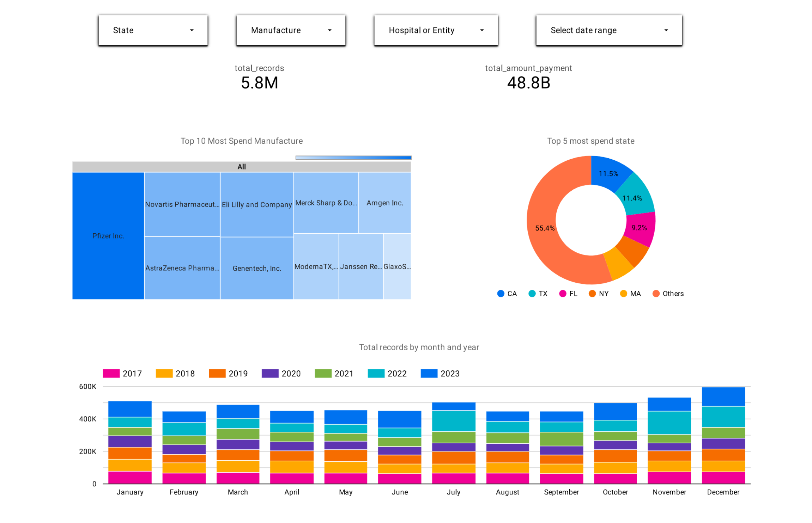

# CMS Open Payments Research Data Pipeline & Analysis

## Project Overview

This project implements an end-to-end data engineering pipeline to analyze research-related payments recorded in the CMS (Centers for Medicare & Medicaid Services) Open Payments dataset. The goal is to provide insights into the financial relationships between healthcare manufacturers/GPOs and teaching hospitals/research entities from 2017 to 2023.

## 1. Problem Description

**Problem:** The CMS Open Payments program collects and makes publicly available extensive data on financial transactions between drug and medical device companies (manufacturers/GPOs) and healthcare providers (physicians, teaching hospitals). While this data promotes transparency, its raw format is large, complex, and challenging to analyze directly, especially for specific areas like research payments over multiple years. Understanding the scale, trends, and distribution of these research payments requires significant data processing and structuring.

**Solution:** This project addresses this challenge by building an automated data pipeline that:
1.  **Ingests** research payment data spanning multiple years (2017-2023).
2.  **Stores** the raw data efficiently in a data lake.
3.  **Loads** the data into a structured data warehouse.
4.  **Transforms** the data for analytical use, focusing on key entities like manufacturers and hospitals.
5.  **Visualizes** key metrics and trends through an interactive dashboard.

The project provides a clear, aggregated view of research funding flows, enabling easier exploration of total spending and transaction volumes by manufacturers and recipient hospitals/research entities over time.

## 2. Cloud Environment

*   **Platform:** Google Cloud Platform (GCP) is used for storage (GCS) and data warehousing (BigQuery).
*   **Development & Orchestration:**
    *   Data ingestion is orchestrated using Apache Airflow, running locally via Docker containers (see `airflow/README.md`).
    *   Data transformations are managed and executed using dbt Cloud (see `dbt/README.md`).
*   **Infrastructure:** The core GCP resources (GCS bucket, BigQuery dataset) can be provisioned using the Terraform configuration provided in the `Terraform/` directory.

### Infrastructure Setup (Terraform)

This project includes Terraform configuration in the `Terraform/` directory to provision the required Google Cloud resources (GCS Bucket and BigQuery Dataset).

1.  **Prerequisites:**
    *   [Install Terraform](https://learn.hashicorp.com/tutorials/terraform/install-cli).
    *   A GCP Service Account key file with permissions to manage GCS and BigQuery resources (e.g., roles like `Storage Admin`, `BigQuery Admin`).

2.  **Navigate to Terraform Directory:**
    ```bash
    cd Terraform
    ```

3.  **Update Variables:**
    *   Open the `variables.tf` file.
    *   Update the `project` variable with your GCP Project ID.
    *   Update the `gcs_bucket_name` to a globally unique name for your bucket.
    *   Update the `bq_dataset_name` if desired.
    *   Ensure the `credentials` variable points to the correct path of your downloaded GCP service account key file.

4.  **Initialize Terraform:**
    *   Run the following command in the `Terraform` directory to initialize the backend and download the necessary provider plugins:
    ```bash
    terraform init
    ```

5.  **Plan Deployment:**
    *   Run the following command to preview the changes Terraform will make:
    ```bash
    terraform plan
    ```

6.  **Apply Changes:**
    *   If the plan looks correct, apply the changes to create the resources in your GCP project:
    ```bash
    terraform apply
    ```
    *   Type `yes` when prompted to confirm.

**Note:** If you choose not to use Terraform, you must create the GCS bucket and BigQuery dataset manually in your GCP project before proceeding with the Airflow setup. Ensure the names match those expected by the Airflow DAGs (or update the DAGs accordingly).

## 3. Data Ingestion (Batch / Workflow Orchestration)

*   **Tool:** Apache Airflow (running via Docker).
*   **Process:** An end-to-end Airflow DAG (`airflow/dags/CMS_rsrch.py`) orchestrates the batch ingestion process for yearly research payment data:
    1.  Downloads data from the CMS website.
    2.  Extracts the relevant CSV file.
    3.  Converts the CSV data to Parquet format locally within the Airflow worker.
    4.  Uploads the Parquet file to a Google Cloud Storage (GCS) bucket (acting as the data lake).
    5.  Loads the data from GCS into a final BigQuery table using external tables and merge logic.
    6.  Cleans up temporary local files.
*   **Details:** See `airflow/README.md` for setup and execution.

## 4. Data Warehouse (BigQuery)

*   **Loading:** Data ingested via the Airflow pipeline is stored in native BigQuery tables within the `CMS` dataset (specifically the `RSRCH_ALL` table).
*   **partitioning & clustering:** Currently, the BigQuery tables created by dbt models have partitioning and clustering applied.

## 5. Transformations (dbt Cloud)

*   **Tool:** dbt Cloud connected to the `dbt/` directory in this repository.
*   **Process:** dbt models transform the raw data loaded into BigQuery:
    *   **Staging (`models/staging/`):** Cleans, renames, and casts data types from the source table (`RSRCH_ALL`). Includes schema definitions and tests (`schema.yml`).
    *   **Core (`models/core/`):** Builds analytical tables (e.g., `fact_rsrch_all_partitioned_clustered.sql`) from the staging layer.
*   **Details:** See `dbt/README.md` for dbt Cloud setup.

## 6. Dashboard (Looker Studio)

*   **Tool:** Google Looker Studio (formerly Data Studio).
*   **Content:** A dashboard (`Dashboard/dashboard.png` provides a static view) visualizes the transformed data. It includes at least two tiles:
    *   One showing distribution across a category (e.g., spend by state).
    *   One showing trends over time (e.g., payment records per year and month).


